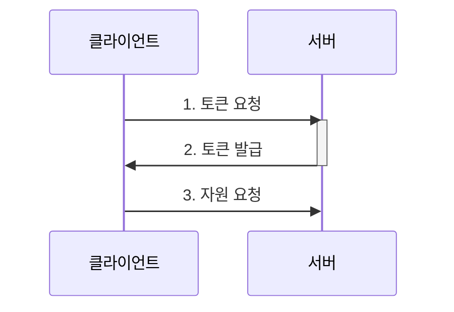

# ElixirJwt

To start your Phoenix server:

  * Install dependencies with `mix deps.get`
  * Create and migrate your database with `mix ecto.setup`
  * Start Phoenix endpoint with `mix phx.server` or inside IEx with `iex -S mix phx.server`

Now you can visit [`localhost:4000`](http://localhost:4000) from your browser.

Ready to run in production? Please [check our deployment guides](https://hexdocs.pm/phoenix/deployment.html).

## 과정

1. 데이터베이스 설정
2. User 등록 구현
  1. User CRUD 찍어내기
  2. 비밀번호 해시 암호화
3. Session 구현
  1. 토큰 발급
  2. Plug를 이용한 토큰 검증

### 데이터베이스 설정

- `config/dev.exs` 파일로 데이터베이스 설정을 한다.
- Phoenix, Ecto, PostgreSQL을 사용했다.

```exs
config :elixir_jwt, ElixirJwt.Repo,
  username: "postgres",
  password: "postgres",
  hostname: "localhost",
  database: "authex_dev",
  stacktrace: true,
  show_sensitive_data_on_connection_error: true,
  pool_size: 10
```

```bash
# postgresql 유저 생성
$ createuser -P postgres

# ecto가 DB를 생성해준다.
$ mix ecto.create

# 데이터베이스 확인하기.
$ psql -d authex_dev
```

### User CRUD 찍어내기

User에 대한 CRUD를 만든다. `phx.gen.html`을 이용한 CRUD 찍어낸다.

```bash
$ mix phx.gen.json Accounts User users name:string username:string password_hash:string
$ mix ecto.migrate
20:59:50.355 [info] create table users
20:59:50.363 [info] == Migrated 20230110111124 in 0.0s
```

- Accounts -- Context
- User -- Resource
- users -- DB 테이블 이름으로 쓸 복수형 명사
- 값:타입 쌍 -- 필드

`phx.gen.json`을 이용하면 아래와 같이 파일이 여럿 생긴다.
[mix phx.gen.json](https://hexdocs.pm/phoenix/Mix.Tasks.Phx.Gen.Json.html) 참고.

- `priv/repo/migrations/<date>_create_users.exs` -- DB 마이그레이션 정보
- `lib/authex/accounts/user.ex` -- 스키마와 changeset을 정의함
- `lib/authex/accounts.ex` -- Accounts Context. 비즈니스 로직을 모아둠.
- `lib/authex_web/controllers/user_controller.ex` -- 서버에서 요청을 처리하는 로직.
- `lib/authex_web/views/user_view.ex` -- 응답 포맷에 대한 함수들

### 비밀번호 해시 암호화

`User`의 CRUD는 비밀번호 때문에 특별해야한다. 사용자로부터 비밀번호를 받아
확인해야하지만 데이터베이스에는 실제 비밀번호가 아닌 이를 암호화한 해시값을
저장해야 한다.

이를 위해 `AuthEx.Accounts.User` 스키마에 두 가지 비밀번호 필드를 만든다:

- `password_hash`: 사용자 비밀번호를 해시 알고리즘으로 저장하기 위함
- `password`: 입력으로 받아 해시 알고리즘에 넣어 저장된 비밀번호와 비교하기 위함
  실제로 DB에는 저장되지 않는 필드이므로 `virtual` 속성을 준다.
  -- [Ecto.Schema](https://hexdocs.pm/ecto/Ecto.Schema.html#field/3)

두 패스워드 필드를 이용하여 User를 생성하는 로직을 새로 만들자:

1. `Authex.Accounts.User`에 비밀번호를 받아 검증하는 `changeset`을 만든다.
2. `Authex.Accounts`에 위의 `changeset`을 이용하여 DB에 유저를 등록하는 로직을 만든다.
3. `Authex.UserController`에 2번에서 만든 함수를 이용하여 유저를 저장하도록 `create` 함수를 고친다.

```diff
schema "users" do
  field :name, :string
  field :username, :string
  field :password_hash, :string
+ field :password, :string, virtual: true
  ...
```

elixir phoenix에서는 모델 검증을 `changeset` 메소드가 맡는다. 비밀번호 검증에
활용할 수 있도록 이를 확장하여 새로운 `changeset`을 하나 더 만든다.

```elixir
# 일반적으로 활용할 changeset
def changeset(user, attrs) do
  user
  |> cast(attrs, [:name, :username])
  |> validate_required([:name, :username])
end

# password를 입력받을 때 쓸 changeset
def registration_changeset(user, attrs) do
  user
  |> changeset(attrs)
  |> cast(attrs, [:password])
  |> validate_required([:password])
  |> validate_length(:password, min: 6)
  |> hash_password()
end
```

새로 만든 `registration_changeset`을 이용하여 유저를 등록하는 함수
`register_user`를 `Accounts` Context에 만든다.

```elixir
def register_user(attrs \\ %{}) do
  %User{}
  |> User.registration_changeset(attrs)
  |> Repo.insert()
end
```

### 세션 설계



세션 발급을 위해 API를 만든다.

- `POST /api/login` -- 토큰 요청

로그아웃은 클라이언트에서 토큰을 버리기만 하면 되므로 서버에서 구현하지 않는다.

토큰을 발급하고 나면 클라이언트에서는 다음처럼 요청 헤더에 토큰을 함께 보낸다.

```
Authorization: Token jwt.token.here
```

서버에서는 이것이 유효한지 검증해야하므로 미들웨어를 작성해야한다.
Phoenix에서는 Plug를 이용하여 작성한다.

### 토큰 발급

1. POST로 username과 password를 받는다.
2. password를 hash한 결과가 저장된 것과 동일한지 확인한다.
3. 동일하면 아래와 같은 JSON을 반환한다.
    ```json
    {
      "user": {
        "token": "jwt.token.here",
        "name": "name",
        "username": "username"
      }
    }
    ``` 
`AuthexWeb.Router`에서 엔드포인트를 컨트롤러로 라우팅해준다. API 서버로서
JSON을 주고 받을 것이기 때문에 `:api` 파이프라인을 이용한다.

```elixir
scope "/api", AuthexWeb do
  pipe_through :api

  post "/users/login", UserController, :login
end
```

`UserController`에 `:login`을 구현한다.

```elixir
def login(conn, %{"username" => username, "password" => password}) do
  with {:ok, user} <- Accounts.verify_user_password(username, password),
       token <- Accounts.issue_token(user) do
    conn
    |> render("user.json", user: user, token: token)
  else
    _ ->
      {:error, ""}

    {:error, reason} ->
      {:error, reason}
  end
end
```

### Plug를 이용한 토큰 검증

[Plug](https://hexdocs.pm/phoenix/plug.html)

Phoenix는 plug의 결합으로 이루어져있다.

```elixir
pipeline :browser do
  plug :accepts, ["html"]
  plug :fetch_session
  plug :fetch_live_flash
  plug :put_root_layout, {AuthexWeb.LayoutView, :root}
  plug :protect_from_forgery
  plug :put_secure_browser_headers
end
```